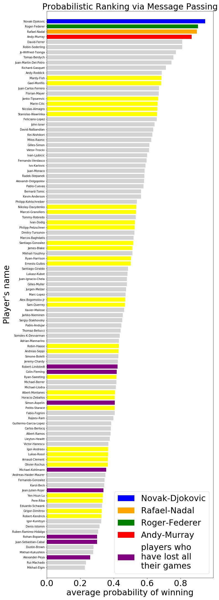

# Probabilistic Ranking of tennis players

Given a record of 1801 game outcomes (win or lose) between 107 players, a naive approach to rank these players would be based on how many games each player won, out of all the games they played. The result is named "**Empirical Ranking**" and shown in the left bar chart below.

<!-- 

  

 -->

The problem with Empirical Ranking is that it ignores against whom each player have played. For example, if player X was unfortunate in that he/she had to play against the world's champion in the first round of a tournament, and hence lost (all) his/her game, Empirical Ranking would suggest that X should be ranked last. However X could possibly have had the ability to defeat most players, and should possibly be ranked higher.

A remedy is to infer every player's "**skill**" (the mentioned notion of "ability") from all the game outcomes, then calculate their 

  
  
  

