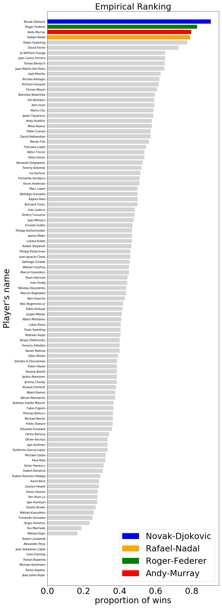
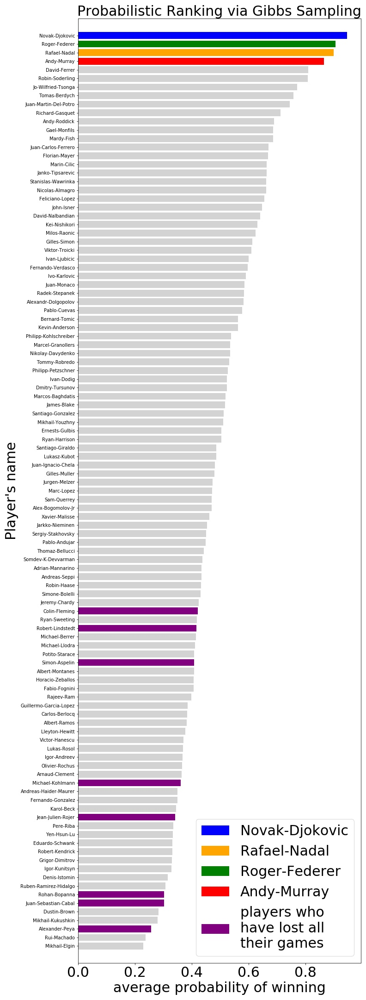
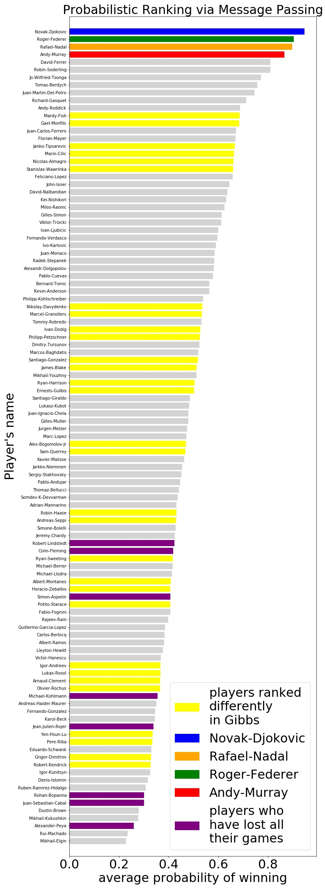
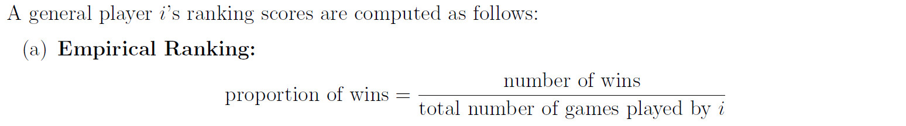
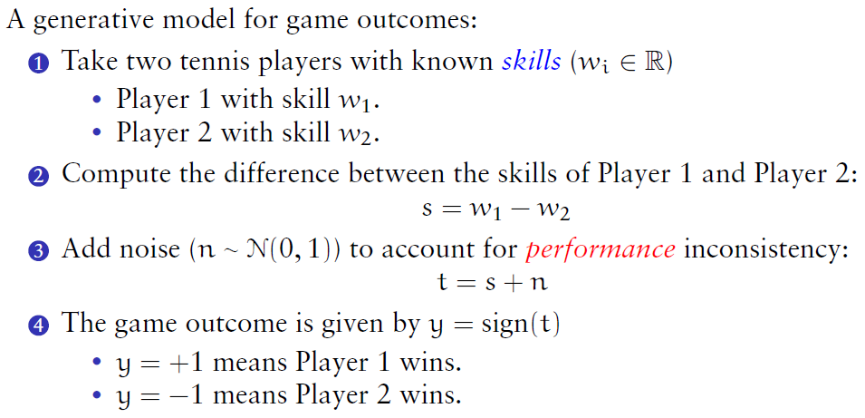
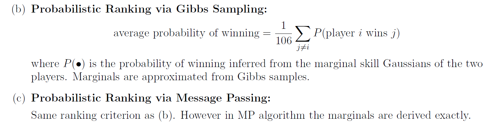

# Probabilistic Ranking of tennis players

  
  
  

---

Given a record of 1801 game outcomes (win or lose) between 107 players, a naive approach to rank these players would be based on how many games each player won, out of all the games they played. The result is named "**Empirical Ranking**" and shown in the left bar chart.

  

The problem with Empirical Ranking is that **it ignores against whom each player have played**. For example, if player X was unfortunate in that he/she had to play against the world's champion in the first round of a tournament, and hence lost (all) his/her game, Empirical Ranking would suggest that X should be ranked last. However X could possibly have had the ability to defeat most players, and should possibly be ranked higher.

---

Therefore, a remedy is to infer from all the game outcomes every player's "**skill**" (the mentioned notion of "ability"), and build a generative model for game outcome between two players. The generative model uses these skills as model parameters to predict a game outcome in the following way:

  

Finally the players can be ranked according to their **average probability of winning**, leading to "**Probabilistic Ranking**":

  

---

*Demo above is part of my university coursework. Details of problem statements and analysis can be found in `Problems.pdf` and `Report.pdf` respectively, while details of how skills were inferred via **Gibbs Sampling** and **Messaging Passing** can be found in the `theories` folder.*

